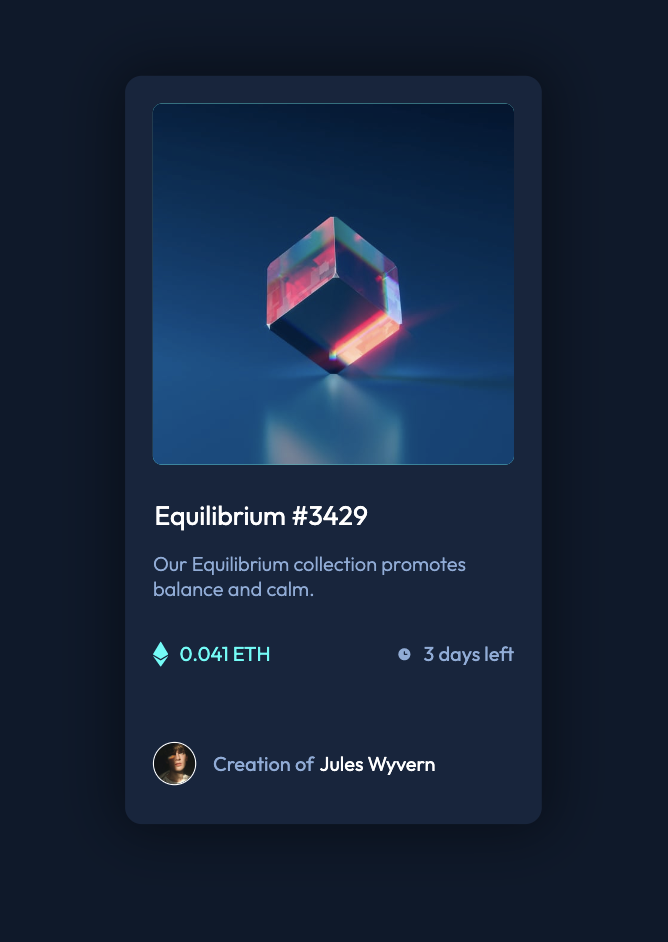

# Frontend Mentor - NFT preview card component solution

<!-- This is a solution to the [NFT preview card component challenge on Frontend Mentor](https://www.frontendmentor.io/challenges/nft-preview-card-component-SbdUL_w0U). Frontend Mentor challenges help you improve your coding skills by building realistic projects.  -->

## Table of contents

- [Overview](#overview)
  - [The challenge](#the-challenge)
  - [Screenshot](#screenshot)
  - [Links](#links)
- [My process](#my-process)
  - [Built with](#built-with)
  - [What I learned](#what-i-learned)
  - [Continued development](#continued-development)
  - [Useful resources](#useful-resources)
- [Author](#author)
- [Acknowledgments](#acknowledgments)

## Overview

### The challenge

Users should be able to:

- View the optimal layout depending on their device's screen size
- See hover states for interactive elements

### Screenshot



### Links

- Solution URL: [https://github.com/Andreas-Ziegler22/Frontend-Mentor-NFT-preview-card-component](https://github.com/Andreas-Ziegler22/Frontend-Mentor-NFT-preview-card-component)
- Live Site URL: [https://andreas-ziegler22.github.io/Frontend-Mentor-NFT-preview-card-component/](https://andreas-ziegler22.github.io/Frontend-Mentor-NFT-preview-card-component/)

## My process

### Built with

- Semantic HTML5 markup
- CSS custom properties
- Flexbox

- Mobile-first workflow

### What I learned

Todo the layout it was easy didn't have any problem to do it

when I finished and started working on the small details I had a small war if :hover

see loads of tutorials are nice and helpful
when you take yourself in to do the job is when you truly learn how to do. 💪

To see how you can add code snippets, see below:

```html
<main>
  <div class="card">
    <div class="container-card">
      
      <div class="middle">
        
      </div>
    </div>
    <p3 class="title cyan">Equilibrium #3429</p3>
    <p class="text">Our Equilibrium collection promotes balance and calm.</p>
    <div class="small-flex-group">
      <p class="left">
        
        0.041 ETH
      </p>
      <p class="right">
        
        3 days left
      </p>
      <span></span>
      <div class="card-bottom-Avatar">
        
        <p>
          <span class="highlight-avatar">Creation of</span
          ><span class="cyan">Jules Wyvern</span>
        </p>
      </div>
    </div>
  </div>
</main>
```

```css
.:root {
  --pr-clr-blue: hsl(215, 51%, 70%);
  --pr-clr-Cyan: hsl(178, 100%, 50%);
  --n-bg-main: hsl(217, 54%, 11%);
  --n-bg-card: hsl(216, 50%, 16%);
  --n-bg-line: hsl(215, 32%, 27%);
  --white-color: hsl(0, 0%, 100%);
}

* {
  box-sizing: border-box;
}

body {
  background-color: var(--n-bg-main);
  font-family: "Outfit", sans-serif;
  min-width: 100vh;
  display: flex;
  flex-direction: column;
  justify-content: center;
  align-items: center;
  font-size: 1.125rem;
}

.card {
  width: 375px;
  background-color: var(--n-bg-card);
  margin-top: 80px;
  border-radius: 15px;
  box-shadow: 0px 0px 50px 10px rgba(0, 0, 0, 0.4);
  display: flex;
  flex-direction: column;
  align-items: center;
  padding: 25px;
}
.container-card {
  position: relative;
  display: flex;
  flex-direction: column;
  justify-content: center;
  align-items: center;
  background-color: var(--pr-clr-Cyan);
  border-radius: 8px;
  width: 100%;
  opacity: 1;
  cursor: pointer;
}

img {
  width: 100%;
  border-radius: 8px;
  opacity: 1;
}
.title {
  color: var(--white-color);
  margin-left: -130px;
  font-size: 1.5rem;
  margin-top: 30px;
  font: 600;
}

.text {
  color: var(--pr-clr-blue);
  font-weight: 300;
  font-size: 1.125rem;
}

.small-flex-group {
  display: flex;
  flex-direction: row;
  flex-wrap: wrap;
  justify-content: space-between;
  align-items: center;
}

.left {
  color: var(--pr-clr-Cyan);
  display: flex;
  align-items: center;
}

.right {
  color: var(--pr-clr-blue);
  display: flex;
  align-items: center;
}

.icon {
  width: 1.5rem;
  padding-right: 10px;
}

span {
  width: 100%;
  border: 1px solid var(--n-bg-line);
  margin: 20px 0;
}

.card-bottom-Avatar {
  color: var(--white-color);
  display: flex;
  flex-direction: row;
  justify-content: flex-start;
  align-items: center;
}

.avatar {
  border: 1px solid var(--white-color);
  border-radius: 50%;
  width: 12%;
  height: 12%;
  margin-right: 15px;
  font-weight: 300;
  text-align: center;
}

.highlight-avatar {
  border: none;
  color: var(--pr-clr-blue);
  margin-right: 5px;
}
span {
  border: none;
}
/* HOVER section */

.icon-view {
  width: 60px;
}

.middle {
  transition: 0.5s ease;
  position: absolute;
  opacity: 0;
}

.container-card:hover .middle {
  opacity: 1;
}

.container-card:hover img {
  opacity: 0.5;
}

.cyan:hover {
  color: var(--pr-clr-Cyan);
  cursor: pointer;
}
```

```js
const proudOfThisFunc = () => {
  console.log("🎉");
};
```

### Continued development

I'm sure that can improve more my HTML and CSS

### Useful resources

- [resource 1](https://www.w3schools.com/howto/tryit.asp?filename=tryhow_css_image_overlay_opacity) - w3schools.com How To - Image Hover Overlay
- [ resource 2](https://html-css-js.com/css/generator/box-shadow/) - Box-Shadow CSS Generator my favorite!

## Author

- Website - [Andy](https://github.com/Andreas-Ziegler22)
- Frontend Mentor
